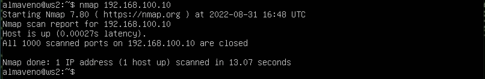
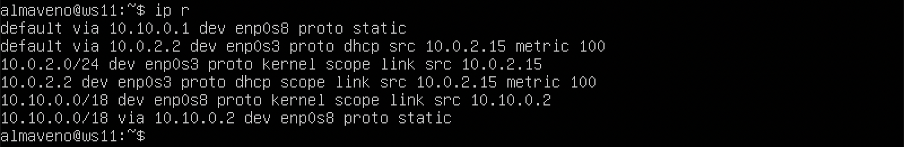
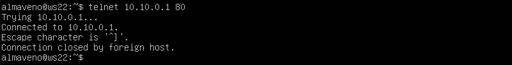

# Сети в Linux by Almaveno

Настройка сетей в Linux на виртуальных машинах.

## Contents

1. [Инструмент ipcalc](#part-1-инструмент-ipcalc)
2. [Статическая маршрутизация между двумя машинами](#part-2-статическая-маршрутизация-между-двумя-машинами)
3. [Утилита iperf3](#part-3-утилита-iperf3)
4. [Сетевой экран](#part-4-сетевой-экран)
5. [Статическая маршрутизация сети](#part-5-статическая-маршрутизация-сети)
6. [Динамическая настройка IP с помощью DHCP](#part-6-динамическая-настройка-ip-с-помощью-dhcp)
7. [NAT](#part-7-nat)
8. [Допополнительно. Знакомство с SSH Tunnels](#part-8-дополнительно-знакомство-с-ssh-tunnels)

## Part 1. Инструмент **ipcalc**

**== Задание 1 ==**

##### Поднять виртуальную машину (далее -- ws1)

**== Выполнение ==**

 *ws1* 

 

**== Задание 1.1 ==**

#### 1.1. Сети и маски
##### Определить и записать в отчёт:
##### 1) Адрес сети *192.167.38.54/13*
##### 2) Перевод маски *255.255.255.0* в префиксную и двоичную запись, */15* в обычную и двоичную, *11111111.11111111.11111111.11110000* в обычную и префиксную
##### 3) Минимальный и максимальный хост в сети *12.167.38.4* при масках: */8*, *11111111.11111111.00000000.00000000*, *255.255.254.0* и */4*

**== Выполнение ==**

* Устанавливаем ipcalc командой  `sudo apt install ipcalc`

 *Доступные команды ipcalc* 

##### Task 1

* Указываем сетевую маску в качестве входных данных хоста

 *Вывод* 

* Получаем адрес сети 192.167.38.54/13 - 192.167.38.54

##### Task 2

* Указываем адрес IPv4 в качестве входных данных хоста

 *Вывод* 

* Получаем перевод маски 255.255.255.0 в префиксную запись - /24

* Перевод маски 255.255.255.0 в бинарную запись - 11111111.11111111.11111111. 000000000

* Указываем префиксный вариант обозначения маски подсети в качестве входных данных

 *Вывод* 

* Получаем перевод маски /15 в обычную запись - 255.254.0.0

* Перевод маски /15 в бинарную запись - 11111111.11111110.00000000. 000000000

* Получаем перевод маски 11111111.11111111.11111111.11110000  в обычную запись - 255.255.255.240

* Перевод маски 11111111.11111111.11111111.11110000  в префиксную запись - /28

##### Task 3

* Указываем сеть *12.167.38.4* и маску: */8* в качестве входных данных

 *Вывод* 

* Минимальный хост - 12.0.0.1

* Максимальный хост - 12.255.255.254

* Указываем сеть *12.167.38.4* и маску: *11111111.11111111.00000000.00000000* в качестве входных данных (мы не можем указать двоичную форму адреса в качестве ввода ipcalc, поэтому используем маску */16*)

 *Вывод* 

* Минимальный хост - 12.167.0.1

* Максимальный хост - 12.167.255.254

* Указываем сеть *12.167.38.4* и маску: *255.255.254.0* в качестве входных данных

 *Вывод* 

* Минимальный хост - 12.167.38.1

* Максимальный хост - 12.167.39.254

 

**== Задание 1.2 ==**

#### 1.2. localhost
##### Определить и записать в отчёт, можно ли обратиться к приложению, работающему на localhost, со следующими IP: *194.34.23.100*, *127.0.0.2*, *127.1.0.1*, *128.0.0.1*

**== Выполнение ==**

* 127.0.0.1 — это адрес петлевого интернет-протокола (IP), также называемый [localhost]. Адрес используется для установления IP-соединения с тем же компьютером или компьютером, который используется конечным пользователем. Установление соединения с использованием адреса 127.0.0.1 является наиболее распространенной практикой, при этом использование любого IP-адреса в диапазоне 127. *. *. * будет работать аналогично.
* Следовательно, можно обратиться к приложению, работающему на localhost, с IP: *127.0.0.2*, *127.1.0.1*

 

**== Задание 1.3 ==**

#### 1.3. Диапазоны и сегменты сетей
##### Определить и записать в отчёт:
##### 1) какие из перечисленных IP можно использовать в качестве публичного, а какие только в качестве частных: *10.0.0.45*, *134.43.0.2*, *192.168.4.2*, *172.20.250.4*, *172.0.2.1*, *192.172.0.1*, *172.68.0.2*, *172.16.255.255*, *10.10.10.10*, *192.169.168.1*
##### 2) какие из перечисленных IP адресов шлюза возможны у сети *10.10.0.0/18*: *10.0.0.1*, *10.10.0.2*, *10.10.10.10*, *10.10.100.1*, *10.10.1.255*

 

**== Выполнение ==**

* Публичные: *134.43.0.2*, *172.0.2.1*, *192.172.0.1*, *192.169.168.1*

* Частные: *10.0.0.45*, *10.10.10.10*, *192.168.4.2*, *172.20.250.4*, *172.68.0.2*, *172.16.255.255*

* Из перечисленных IP адресов шлюза возможны у сети 10.10.0.0/18: *10.10.0.2*, *10.10.10.10*, *10.10.100.1*, *10.10.1.255*

 

## Part 2. Статическая маршрутизация между двумя машинами

##### Поднять две виртуальные машины (далее -- ws1 и ws2)

**== Задание 1 ==**

##### С помощью команды `ip a` посмотреть существующие сетевые интерфейсы
- В отчёт поместить скрин с вызовом и выводом использованной команды.
##### Описать сетевой интерфейс, соответствующий внутренней сети, на обеих машинах и задать следующие адреса и маски: ws1 - *192.168.100.10*, маска */16*, ws2 - *172.24.116.8*, маска */12*
- В отчёт поместить скрины с содержанием изменённого файла */etc/netplan/00-installer-config.yaml* для каждой машины.
##### Выполнить команду `netplan apply` для перезапуска сервиса сети
- В отчёт поместить скрин с вызовом и выводом использованной команды.

**== Выполнение ==**

##### ws1

* С помощью команды `ip a` смотрим существующие сетевые интерфейсы
 *Вывод* 
* Командой ` sudo vim /etc/netplan/00-installer-config.yaml ` открываем файл для редактирования
 *Содержание изменённого файла* 
* Выполняем команду `sudo netplan apply` для перезапуска сервиса сети
 *Вывод* 
* Проверяем сохранились ли изменения командой ` ip a `
 *Вывод* 

##### ws1

* С помощью команды `ip a` смотрим существующие сетевые интерфейсы
 *Вывод* 
* Командой ` sudo vim /etc/netplan/00-installer-config.yaml` открываем файл для редактирования
 *Содержание изменённого файла* 
* Выполняем команду `sudo netplan apply` для перезапуска сервиса сети
 *Вывод* 
* Проверяем сохранились ли изменения командой `ip a`
 *Вывод* 

**== Задание 2.1 ==**

#### 2.1. Добавление статического маршрута вручную
##### Добавить статический маршрут от одной машины до другой и обратно при помощи команды вида `ip r add`
##### Пропинговать соединение между машинами
- В отчёт поместить скрин с вызовом и выводом использованных команд.

**== Выполнение ==**

* Tool -> preferences -> network -> создаем новую сеть malina
* Settings -> network -> включаем адаптер, выбираем NAT network malina у каждой виртуальной машины
* Добавляем статический маршрут от ws1 до ws2 при помощи команды вида `ip r add`
 *Вывод* 
* Добавляем статический маршрут от ws2 до ws1 при помощи команды вида `ip r add`
 *Вывод* 
* Командой ` ping -c 3 172.24.116.8 ` пингуем ws2 c ws1 (3 раза)
 *Вывод* 
* Командой ` ping -c 3 192.168.100.10 ` пингуем ws1 c ws2 (3 раза)
 *Вывод* 

**== Задание 2.2 ==**

#### 2.2. Добавление статического маршрута с сохранением
##### Перезапустить машины
##### Добавить статический маршрут от одной машины до другой с помощью файла */etc/netplan/00-installer-config.yaml*
- В отчёт поместить скрин с содержанием изменённого файла */etc/netplan/00-installer-config.yaml*.
##### Пропинговать соединение между машинами
- В отчёт поместить скрин с вызовом и выводом использованной команды.

**== Выполнение ==**

* Перезапускаем машины командой `reboot`
* Добавляем статический маршрут от одной машины до другой с помощью файла */etc/netplan/00-installer-config.yaml*

 *00-installer-config.yaml ws1* 
* Выполняем команду `sudo netplan apply` для перезапуска сервиса сети

  

 *00-installer-config.yaml ws2* 
* Выполняем команду `sudo netplan apply` для перезапуска сервиса сети
* Командой ` ping -c 1 172.24.116.8 ` пингуем ws2 c ws1
 *Вывод* 
* Командой ` ping -c 1 192.168.100.10 ` пингуем ws1 c ws2
 *Вывод* 

  

 ## Part 3. Утилита **iperf3**

**== Задание 3.1 ==**

#### 3.1. Скорость соединения
##### Перевести и записать в отчёт: 8 Mbps в MB/s, 100 MB/s в Kbps, 1 Gbps в Mbps

**== Выполнение ==**

* 8 Мегабит в секунду /8 = 1 Мегабайт в секунду
* 100 Мегабайт в секунду *1000 *8 = 800000 Килобит в секунду
* 1 Гигабит в секунду *1000 = 1000 Мегабит в секунду

 

**== Задание 3.2 ==**

#### 3.2. Утилита **iperf3**
##### Измерить скорость соединения между ws1 и ws2
- В отчёт поместить скрины с вызовом и выводом использованных команд.

**== Выполнение ==**

* Устанавливаем утилиту `iperf3` командой `sudo apt install iperf3` на обе машины.
* На ws1 запускаем iperf3 в режиме сервера: `iperf3 -s`
* Теперь к ws1 можно подключаться по порту 5201 клиентам iperf3:
 *Вывод* 
* На клиенте (ws2) запускаем iperf3 с указанием IP сервера к которому подключаемся `iperf3 -c 192.168.120.100 -R`, где
* `-с` — адрес сервера с запущенным iperf3 на 5201 порту
* `-R` — режим Reverse Mode для тестирования входящей скорости
* Получаем скорость около 4.84 Gbits/sec
 *Вывод на ws2* 
 *Вывод на ws1* 
 

## Part 4. Сетевой экран

**== Задание 4.1 ==**

#### 4.1. Утилита **iptables**
##### Создать файл */etc/firewall.sh*, имитирующий фаерволл, на ws1 и ws2:
##### Нужно добавить в файл подряд следующие правила:
##### 1) на ws1 применить стратегию когда в начале пишется запрещающее правило, а в конце пишется разрешающее правило (это касается пунктов 4 и 5)
##### 2) на ws2 применить стратегию когда в начале пишется разрешающее правило, а в конце пишется запрещающее правило (это касается пунктов 4 и 5)
##### 3) открыть на машинах доступ для порта 22 (ssh) и порта 80 (http)
##### 4) запретить *echo reply* (машина не должна "пинговаться”, т.е. должна быть блокировка на OUTPUT)
##### 5) разрешить *echo reply* (машина должна "пинговаться")
- В отчёт поместить скрины с содержанием файла */etc/firewall* для каждой машины.
##### Запустить файлы на обеих машинах командами `chmod +x /etc/firewall.sh` и `/etc/firewall.sh`
- В отчёт поместить скрины с запуском обоих файлов.
- В отчёте описать разницу между стратегиями, применёнными в первом и втором файлах.

**== Выполнение ==**
 * Командой ` sudo vim /etc/firewall.sh ` создаем файл, имитирующий фаерволл и открываем его для редактирования:
  *firewall.sh на ws1* 
  *firewall.sh на ws2* 
 * Запустить файл командами `sudo chmod +x /etc/firewall.sh` и `sudo bash /etc/firewall.sh`
  *Вывод на ws1* 
  *Вывод на ws2* 
 * Пингуем машины
  *Пинг ws2 с ws1* 
  *Пинг ws1 с ws2* 
 * Разница между стратегиями: для того, чтобы одна машинга пинговалась, а вторая нет, не обязательно писать обе строки, так как правила обрабатываются в порядке их написания.

 

**== Задание 4.2 ==**

#### 4.2. Утилита **nmap**
##### Командой **ping** найти машину, которая не "пингуется", после чего утилитой **nmap** показать, что хост машины запущен
*Проверка: в выводе nmap должно быть сказано: `Host is up`*
- В отчёт поместить скрины с вызовом и выводом использованных команд **ping** и **nmap**.

##### Сохранить дампы образов виртуальных машин
**p.s. Ни в коем случае не сохранять дампы в гит!**

**== Выполнение ==**
* Пингуем с каждой машины себя и вторую машину
 *Вывод на ws1* 
 *Вывод на ws2* 
* Видим что не пингуется ws1(192.168.100.10)
* Запускаем команду ` nmap ws1 ` с **ws1** и видим `Host is up` - хост запущен
 *Вывод на ws1* 
* Запускаем команду ` nmap 192.168.100.10 ` с **ws2** и видим `Host is up` - хост запущен
 *Вывод на ws2* 
* Делаем в VirtualBox снапшот ` snapshots` -> ` take`
 

## Part 5. Статическая маршрутизация сети

**== Задание 5.0 ==**

##### Поднять пять виртуальных машин (3 рабочие станции (ws11, ws21, ws22) и 2 роутера (r1, r2))

**== Выполнение ==**

 *VirtualBox* 

 

**== Задание 5.1 ==**

#### 5.1. Настройка адресов машин
##### Настроить конфигурации машин в *etc/netplan/00-installer-config.yaml* согласно сети на рисунке.
- В отчёт поместить скрины с содержанием файла *etc/netplan/00-installer-config.yaml* для каждой машины.
##### Перезапустить сервис сети. Если ошибок нет, то командой `ip -4 a` проверить, что адрес машины задан верно. Также пропинговать ws22 с ws21. Аналогично пропинговать r1 с ws11.
- В отчёт поместить скрины с вызовом и выводом использованных команд.

**== Выполнение ==**
* Cодержание файла *etc/netplan/00-installer-config.yaml* для каждой машины:

 *ws11* 

 *ws21* 

 *ws22* 

 *r1* 

 *r2* 

* Перезапускаем сервис сети на каждой машине командой ` sudo netplan apply `
* Командой `ip -4 a` проверяем, что адрес машины задан верно:

 *ws11* 

 *ws21* 

 *ws22* 

 *r1* 

 *r2* 

* Пингуем **ws22** с **ws21** 

 *Вывод* 

* Пингуем **r1** с **ws11**

 *Вывод* 

 

**== Задание 5.2 ==**

#### 5.2. Включение переадресации IP-адресов.
##### Для включения переадресации IP, выполните команду на роутерах:
`sysctl -w net.ipv4.ip_forward=1`
*При таком подходе переадресация не будет работать после перезагрузки системы.*
- В отчёт поместить скрин с вызовом и выводом использованной команды.
##### Откройте файл */etc/sysctl.conf* и добавьте в него следующую строку:
`net.ipv4.ip_forward = 1`
*При использовании этого подхода, IP-переадресация включена на постоянной основе.*
- В отчёт поместить скрин с содержанием изменённого файла */etc/sysctl.conf*.

**== Выполнение ==**

* Для включения временной переадресации IP выполняем команду на роутерах: 
`sudo sysctl -w net.ipv4.ip_forward=1`

 *r1* 

 *r2* 

* Для включения **IP-переадресации** на постоянной основе добавляем в файл */etc/sysctl.conf* следующую строку: `net.ipv4.ip_forward = 1`

 *r1* 

 *r2* 

* Перезагружаем и выполняем команду `sysctl net.ipv4.ip_forward` для проверки: 

 *r1* 

 *r2* 

* Параметр ядра net.ipv4.ip_forward равен 1. Это означает, что переадресация включена.
 

**== Задание 5.3 ==**

#### 5.3. Установка маршрута по-умолчанию
##### Настроить маршрут по-умолчанию (шлюз) для рабочих станций. Для этого добавить `default` перед IP роутера в файле конфигураций
- В отчёт поместить скрин с содержанием файла *etc/netplan/00-installer-config.yaml*.
##### Вызвать `ip r` и показать, что добавился маршрут в таблицу маршрутизации
- В отчёт поместить скрин с вызовом и выводом использованной команды.
##### Пропинговать с ws11 роутер r2 и показать на r2, что пинг доходит. Для этого использовать команду:
`tcpdump -tn -i eth1`
- В отчёт поместить скрин с вызовом и выводом использованных команд.

**== Выполнение ==**

* Добавляем маршрут по-умолчанию в файле конфигураций *etc/netplan/00-installer-config.yaml*.

 *ws11* 

 *ws21* 

 *ws22* 

* Вызываем `ip r` и показать, что добавился маршрут в таблицу маршрутизации

 *ws11* 

 *ws21* 

 *ws22* 

* Пингуем с ws11 роутер r2:

 *ws11* 

* Показываем на r2, что пинг доходит с помощью команды `tcpdump -tn -i eth1`

 *r2* 

 

**== Задание 5.4 ==**

#### 5.4. Добавление статических маршрутов
##### Добавить в роутеры r1 и r2 статические маршруты в файле конфигураций.
- В отчёт поместить скрины с содержанием изменённого файла *etc/netplan/00-installer-config.yaml* для каждого роутера.
##### Вызвать `ip r` и показать таблицы с маршрутами на обоих роутерах. Пример таблицы на r1:
- В отчёт поместить скрин с вызовом и выводом использованной команды.
##### Запустить команды на ws11:
`ip r list 10.10.0.0/[маска сети]` и `ip r list 0.0.0.0/0`
- В отчёт поместить скрин с вызовом и выводом использованных команд.
- В отчёте объяснить, почему для адреса 10.10.0.0/\[порт сети\] был выбран маршрут, отличный от 0.0.0.0/0, хотя он попадает под маршрут по-умолчанию.

**== Выполнение ==**

* Добавляем в роутеры r1 и r2 статические маршруты в файле конфигураций:

 *r1* 

 *r2* 

* Вызываем `ip r` чтобы показать таблицы с маршрутами на обоих роутерах:

 *r1* 

 *r2* 

* Запускаем команды на ws11:
`ip r list 10.10.0.0/[маска сети]` и `ip r list 0.0.0.0/0`

 *ws21* 

* IP-адрес 0.0.0.0 означает «эта сеть», но для использования в традиционном смысле этот адрес непригоден. Это похоже на ссылку: «Вставьте сюда адрес», или, в зависимости от контекста, «без конкретного адреса назначения». Он действует как резервный, пока не будет назначен действительный маршрутизируемый IP-адрес. Вариант использования IP-адреса 0.0.0.0 в качестве статического маршрута по умолчанию означает, что в таблице маршрутизации не указан конкретный адрес в качестве следующего перехода на пути пакета к его конечному получателю. Когда маршрут по умолчанию используется с маской подсети 0.0.0.0, он соответствует любому адресу.

 

**== Задание 5.5 ==**

#### 5.5. Построение списка маршрутизаторов
##### Запустить на r1 команду дампа:
`tcpdump -tnv -i eth0`
##### При помощи утилиты **traceroute** построить список маршрутизаторов на пути от ws11 до ws21
- В отчёт поместить скрины с вызовом и выводом использованных команд (tcpdump и traceroute).
- В отчёте, опираясь на вывод, полученный из дампа на r1, объяснить принцип работы построения пути при помощи **traceroute**.

**== Выполнение ==**

* Проверяем пинг **ws21** c **ws11**
 *ws11* 
* Запускаем на r1 команду дампа: `tcpdump -tnv -i enp0s8`
 *Вывод* 
* При помощи утилиты **traceroute** строим список маршрутизаторов на пути от ws11 до ws21:
 *ws11* 
* Команда traceroute linux использует UDP пакеты. Она отправляет пакет с TTL=1 и смотрит адрес ответившего узла, дальше TTL=2, TTL=3 и так пока не достигнет цели. Каждый раз отправляется по три пакета и для каждого из них измеряется время прохождения. Когда утилита traceroute получает сообщение от целевого узла о том, что порт недоступен трассировка считается завершенной.

 

**== Задание 5.6 ==**

#### 5.6. Использование протокола **ICMP** при маршрутизации
##### Запустить на r1 перехват сетевого трафика, проходящего через eth0 с помощью команды:
`tcpdump -n -i eth0 icmp`
##### Пропинговать с ws11 несуществующий IP (например, *10.30.0.111*) с помощью команды:
`ping -c 1 10.30.0.111`
- В отчёт поместить скрин с вызовом и выводом использованных команд.
##### Сохранить дампы образов виртуальных машин

**== Выполнение ==**

* Запускаем на r1 перехват сетевого трафика, проходящего через eth0 с помощью команды:
`tcpdump -n -i enp0s8 icmp`
 *r1* 
* Пингуем с ws11 несуществующий IP с помощью команды:
`ping -c 1 10.30.0.111`
 *ws11* 

 

## Part 6. Динамическая настройка IP с помощью **DHCP**

**== Задание 6.1 ==**

##### Для r2 настроить в файле */etc/dhcp/dhcpd.conf* конфигурацию службы **DHCP**:
##### 1) указать адрес маршрутизатора по-умолчанию, DNS-сервер и адрес внутренней сети.
##### 2) в файле *resolv.conf* прописать `nameserver 8.8.8.8.`
- В отчёт поместить скрины с содержанием изменённых файлов.
##### Перезагрузить службу **DHCP** командой `systemctl restart isc-dhcp-server`. Машину ws21 перезагрузить при помощи `reboot` и через `ip a` показать, что она получила адрес. Также пропинговать ws22 с ws21.
- В отчёт поместить скрины с вызовом и выводом использованных команд.

**== Выполнение ==**

* Для r2 настраиваем в файле */etc/dhcp/dhcpd.conf* конфигурацию службы **DHCP**: указываем адрес маршрутизатора по-умолчанию, DNS-сервер и адрес внутренней сети:
 *r2* 
* в файле */etc/resolv.conf* прописать `nameserver 8.8.8.8.`
 *r2* 
* Перезагружаем службу **DHCP** командой `systemctl restart isc-dhcp-server`
 *r2* 
* Через `ip a` показываем, что ws21 получила адрес:
 *ws21* 
* Пингуем ws22 с ws21:
 *ws21* 

 

**== Задание 6.2 ==**

##### Указать MAC адрес у ws11, для этого в *etc/netplan/00-installer-config.yaml* надо добавить строки: `macaddress: 10:10:10:10:10:BA`, `dhcp4: true`
- В отчёт поместить скрин с содержанием изменённого файла *etc/netplan/00-installer-config.yaml*.

**== Выполнение ==**
* Указываем MAC адрес у ws11: в *etc/netplan/00-installer-config.yaml* добляем строки: `macaddress: 10:10:10:10:10:BA`, `dhcp4: true`
 *ws21* 

 

**== Задание 6.3 ==**

##### Для r1 настроить аналогично r2, но сделать выдачу адресов с жесткой привязкой к MAC-адресу (ws11). Провести аналогичные тесты
- В отчёте этот пункт описать аналогично настройке для r2.

**== Выполнение ==**
* Для r1 настраиваем в файле */etc/dhcp/dhcpd.conf* конфигурацию службы **DHCP**: указываем адрес маршрутизатора по-умолчанию, DNS-сервер и адрес внутренней сети:
 *r2* 
* в файле */etc/resolv.conf* прописать `nameserver 8.8.8.8.`
 *r2* 
* Перезагружаем службу **DHCP** командой `systemctl restart isc-dhcp-server`
 *r2* 
* Через `ip a` показываем, что ws11 получила адрес:
 *ws11* 
* Пингуем ws22 с ws11:
 *ws11* 

 

**== Задание 6.4 ==**

##### Запросить с ws21 обновление ip адреса
- В отчёте поместить скрины ip до и после обновления.
- В отчёте описать, какими опциями **DHCP** сервера пользовались в данном пункте.
##### Сохранить дампы образов виртуальных машин

**== Выполнение ==**
* Через `ip a` показываем текущий адрес ws21:
 *ws21* 
* Принудительного освобождаем IP-адрес DHCP-клиента с помощью команды ` sudo dhclient -r`
* Получаем новый IP-адрес с помощью DHCP с помощью команды `sudo dhclient`
 *ws21* 
* Через `ip a` показываем что адрес ws21 сменился:
 *ws21* 
* Какими опциями **DHCP** сервера пользовались в данном пункте:
- Настройка конфигурации службы DHCP (адрес маршрутизатора по-умолчанию, DNS-сервер, адрес внутренней сети, привязка к MAC-адресу)
- Клиент протокола динамической конфигурации хоста (команда dhclient) для обновления или освобождения IP-адреса
 

## Part 7. **NAT**

**== Задание 7 ==**

##### В файле */etc/apache2/ports.conf* на ws22 и r1 изменить строку `Listen 80` на `Listen 0.0.0.0:80`, то есть сделать сервер Apache2 общедоступным
- В отчёт поместить скрин с содержанием изменённого файла.
##### Запустить веб-сервер Apache командой `service apache2 start` на ws22 и r1
- В отчёт поместить скрины с вызовом и выводом использованной команды.

**== Выполнение ==**
* Устанавливаем сервер Apache2 командой `sudo apt install apache2`
* В файле */etc/apache2/ports.conf* на ws22 и r1 изменяем строку `Listen 80` на `Listen 0.0.0.0:80`
 *r1* 
 *ws22* 
* Запускаем веб-сервер Apache командой `service apache2 start` на ws22 и r1
 *r1* 
 *ws22* 
 

**== Задание 7.1-7.3 ==**
##### Добавить в фаервол, созданный по аналогии с фаерволом из Части 4, на r2 следующие правила:
##### 1) Удаление правил в таблице filter - `iptables -F`
##### 2) Удаление правил в таблице "NAT" - `iptables -F -t nat`
##### 3) Отбрасывать все маршрутизируемые пакеты - `iptables --policy FORWARD DROP`
##### Запускать файл также, как в Части 4
##### Проверить соединение между ws22 и r1 командой `ping`
*При запуске файла с этими правилами, ws22 не должна "пинговаться" с r1*
- В отчёт поместить скрины с вызовом и выводом использованной команды.

**== Выполнение ==**
* Создаем на r2 файл /etc/firewall.sh, имитирующий фаерволл
* Добавляем в фаервол следующие правила: 
`iptables -F` 
`iptables -F -t nat` 
`iptables --policy FORWARD DROP` 
 *r2* 
* Запускаем файл командами `sudo chmod +x /etc/firewall.sh` и `sudo bash /etc/firewall.sh`
 *r2* 
* Проверяем соединение между ws22 и r1 командой `ping`, ws22 не должна "пинговаться" с r1
 *r1* 
 

**== Задание 7.4 ==**

##### Добавить в файл ещё одно правило:
##### 4) Разрешить маршрутизацию всех пакетов протокола **ICMP**
##### Запускать файл также, как в Части 4
##### Проверить соединение между ws22 и r1 командой `ping`
*При запуске файла с этими правилами, ws22 должна "пинговаться" с r1*
- В отчёт поместить скрины с вызовом и выводом использованной команды.

**== Выполнение ==**
* Добавляем в фаервол следующие правила: 
`iptables -A INPUT -p icmp --icmp-type 8 -j ACCEPT` 
`iptables -A OUTPUT -p icmp --icmp-type 8 -j ACCEPT` 
 *r2* 
* Запускаем файл командами `sudo chmod +x /etc/firewall.sh` и `sudo bash /etc/firewall.sh`
 *r2* 
* Проверяем соединение между ws22 и r1 командой `ping`, ws22 должна "пинговаться" с r1
 *r1* 

 

**== Задание 7.5-7.6 ==**

##### Добавить в файл ещё два правила:
##### 5) Включить **SNAT**, а именно маскирование всех локальных ip из локальной сети, находящейся за r2 (по обозначениям из Части 5 - сеть 10.20.0.0)
##### 6) Включить **DNAT** на 8080 порт машины r2 и добавить к веб-серверу Apache, запущенному на ws22, доступ извне сети
- В отчёт поместить скрин с содержанием изменённого файла.
##### Запускать файл также, как в Части 4
*Перед тестированием рекомендуется отключить сетевой интерфейс **NAT** (его наличие можно проверить командой `ip a`) в VirtualBox, если он включен*
##### Проверить соединение по TCP для **SNAT**, для этого с ws22 подключиться к серверу Apache на r1 командой:
`telnet [адрес] [порт]`
##### Проверить соединение по TCP для **DNAT**, для этого с r1 подключиться к серверу Apache на ws22 командой `telnet`
- В отчёт поместить скрины с вызовом и выводом использованных команд.
##### Сохранить дампы образов виртуальных машин

**== Выполнение ==**

* Добавляем в фаервол следующие правила: 
 *r2* 
* Отключаем сетевой интерфейс **NAT**
* Запускаем файл командами `sudo chmod +x /etc/firewall.sh` и `sudo bash /etc/firewall.sh`
 *r2* 
* Проверить соединение по TCP для **SNAT**, для этого с ws22 подключаемся к серверу Apache на r1 командой:
`telnet 10.10.0.1 80`
 *ws22* 
* Проверяем соединение по TCP для **DNAT**, для этого с r1 подключаемся к серверу Apache на ws22 командой `telnet 10.20.0.20 80`
 *r1* 
 

## Part 8. Дополнительно. Знакомство с **SSH Tunnels**

**== Задание ==**

##### Запустить на r2 фаервол с правилами из Части 7
##### Запустить веб-сервер **Apache** на ws22 только на localhost (то есть в файле */etc/apache2/ports.conf* изменить строку `Listen 80` на `Listen localhost:80`)
##### Воспользоваться *Local TCP forwarding* с ws21 до ws22, чтобы получить доступ к веб-серверу на ws22 с ws21
##### Воспользоваться *Remote TCP forwarding* c ws11 до ws22, чтобы получить доступ к веб-серверу на ws22 с ws11
##### Для проверки, сработало ли подключение в обоих предыдущих пунктах, перейдите во второй терминал (например, клавишами Alt + F2) и выполните команду:
`telnet 127.0.0.1 [локальный порт]`
- В отчёте описать команды, необходимые для выполнения этих четырёх пунктов, а также приложить скриншоты с их вызовом и выводом.
##### Сохранить дампы образов виртуальных машин

**== Выполнение ==**

* Запускаем на r2 фаервол с правилами из Части 7: 
 *r2* 
* Запускаем файл командами `sudo chmod +x /etc/firewall.sh` и `sudo bash /etc/firewall.sh`
 *r2* 
* Запускаем веб-сервер **Apache** на ws22 только на localhost (то есть в файле */etc/apache2/ports.conf* меняем строку `Listen 80` на `Listen localhost:80`
 *ws22* 
* Воспользуемся *Local TCP forwarding* с ws21 до ws22, чтобы получить доступ к веб-серверу на ws22 с ws21
 *ws21* 
* Воспользуемся *Remote TCP forwarding* c ws11 до ws22, чтобы получить доступ к веб-серверу на ws22 с ws11
 *ws11* 

 
